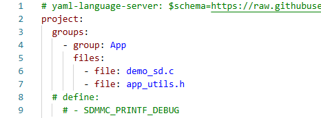
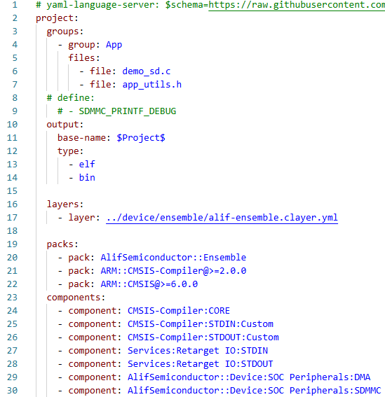
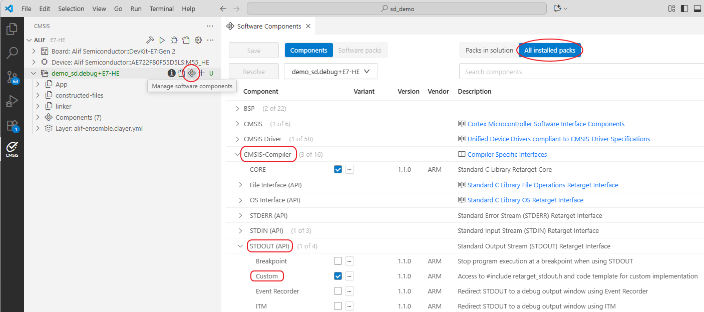
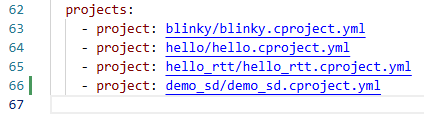

> **Importing Example Projects or Source Code Templates into**
>
> **VS CODE**
>
> Application Note
>
> AAPN0025 v2.0—December 2025
>
> Alif Semiconductor [<u>www.alifsemi.com</u>](http://www.alifsemi.com/)

### Contents

1.  [Introduction](#introduction) [1](#introduction)

2.  [Basic steps to create a new VS Code project](#basic-steps-to-create-a-new-vs-code-project) [2](#basic-steps-to-create-a-new-vs-code-project)

3.  [Legal and Support Information](#legal-and-support-information) [4](#legal-and-support-information)

    1.  [Disclaimers](#legal-and-support-information) [4](#legal-and-support-information)

    2.  [Related Documents and Tools](#3.2__Related_Documents_and_Tools) [4](#3.2__Related_Documents_and_Tools)

    3.  [Contact Information](#_bookmark5) [4](#_bookmark5)

    4.  [Trademarks](#trademarks) [5](#trademarks)

4.  [Revision History](#revision-history) [6](#revision-history)

# Introduction

> This application note details the steps how to load example code into a Visual Studio™ Code (VS Code™).

# Basic steps to create a new VS Code project

1.  Refer to the user guide to create a local copy of the template project and open it in VS Code: https://github.com/alifsemi/alif_vscode-template/blob/main/doc/getting_started.md. You can change the name of the directory to a desired name, such as \<my_project\>.

2.  Create a new source folder that will contain the source code:

    1.  Create a new folder under \<my_project\> and name to the same as the example, such as \<demo_sd\>

    2.  Copy example source code from:

> %localappdata%/arm/packs/AlifSemiconductor/Ensemble/2.0.4/Boards/Templates/Baremetal
>
> Or
>
> %localappdata%/arm/packs/AlifSemiconductor/Ensemble/2.0.4/Boards/\<board_name\>

3.  Match “2.0.4” to the version that you are using.

4.  Paste the source code to source folder, such as \<demo_sd\>.

5.  You may need to copy the “app_utils.h” file under

    %localappdata%/arm/packs/AlifSemiconductor/Ensemble/2.0.4/Boards/Templates/Common/Include into the source folder as well.

<!-- -->

3.  Configure the “xxx.cproject.yml” file under source folder:

    1.  Copy a “xxx.cproject.yml” from any of the three example applications \[blinky, hello, and hello_rtt\] to the current source folder. Rename it to the same as the source folder, such as “demo_sd.cproject.yml”.

    2.  Open “xxx.cproject.yml” and add each source file as an entry under “files” section. Remove the unrelated source files. It should look like Figure 1:

Figure 1. xxx.cproject.yml example

3.  

4.  

5.  

6.  \[Optional\] Add macro defines if needed. See Figure 1 for example.

7.  Add supporting drivers to this project. These drivers are called *components*, and each *component* belongs to a *pack*. For a complete list of ARM *packs* and *components*, please refer to: https://www.keil.arm.com/packs/. For the syntax of the “.cproject.yml” file, please refer to: https://open-cmsis-pack.github.io/cmsis-toolbox/YML-Input-Format/. You can find all the installed *packs* from: %localappdata%/arm/packs

8.  The software *packs’* version can be adjusted in the “*packs*” section.

9.  In this example, a complete demo_sd.cproject.yml file looks like the following:

Figure 2. A complete demo_sd.cproject.yml file

10. In case of adding other drivers (components), please refer to the “Software Components” tool from VS Code.

    Figure 3 indicates how to correctly include “CMSIS-Compiler:STDOUT:Custom” in the xxx.cproject.yml. You can find the hierarchical structure in Figure 3. When specifying a vendor package such as AlifSemiconductor, please use double colon “::”.

Figure 3. Manage Software Components GUI

11. Unused driver/component can be commented out by adding a hashtag in front of the line.

<!-- -->

4.  Configure the “alif.csolution.yml” file under root folder \<my_project\>:

    1.  This file controls project wide configurations, such as selection of compilers, ARM packs, supported targets, and lists all source files (which is referred to as “*projects*” at the end). The software *packs’* version can be adjusted in the “*packs*” section.

    2.  Please create an entry for the source code you just added under the “projects” section. Follow the format:

> \- project: \<source_directory\>/\<xxx.cproject.yml\>

3.  See Figure 4 for an example.

> 
>
> Figure 4. Adding a new source code entry to the alif.csolution.yml file

4.  If other sections are needed, please follow the official syntax document:

    https://open-cmsis-pack.github.io/cmsis-toolbox/YML-Input-Format/.

5.  For a complete list of officially supported targets from AlifSemiconductor, please refer to:

> %localappdata%/arm/packs/AlifSemiconductor/Ensemble/2.0.4/AlifSemiconductor.Ensemble.pdsc
>
> Replace the version number to match your installation.

5.  Mark “alif-ensemble.clayer.yml” read only:

    1.  This is the project wide component configuration file which should remain the same.

    2.  

    3.  You can access it from \<my_project\>/device/ensemble/.

6.  

# Legal and Support Information

## Disclaimers

#### Legal Notice – Please Read

> Alif Semiconductor™ reserves the right, without notice, to alter, edit, update, make corrections, and improvements to Alif documentation and products at any time. It is the responsibility of customers to maintain the most current versions of documentation before making any purchases from Alif. The information found in this documentation is provided to purchasers solely for the purpose of enabling hardware and software implementation of Alif products.
>
> Alif neither takes any responsibility for, nor guarantees the appropriateness of, its products for a specific purpose. Customers accept the responsibility for the selection and incorporation of Alif products into their systems and Alif has no liability with respect thereto. ALIF ALSO DISCLAIMS ANY AND ALL LIABILITY WITH RESPECT THERETO, INCLUDING WITHOUT LIMITATION, DIRECT, CONSEQUENTIAL, INDIRECT, SPECIAL AND INCIDENTAL DAMAGES. ADDITIONALLY, ALIF DISCLAIMS AND EXCLUDES ALL WARRANTIES, WHETHER STATUTORY, EXPRESS OR IMPLIED, INCLUDING ANY IMPLIED WARRANTY OF MERCHANTABILITY, FITNESS FOR A PARTICULAR PURPOSE AND NON-INFRINGEMENT AND THOSE ARISING FROM COURSE OF DEALING AND USAGE OF TRADE.
>
> Alif Semiconductor and the Alif logo are trademarks of Alif. For more information about our trademarks please visit our website at [<u>https://alifsemi.com/legal/</u>](https://alifsemi.com/legal/). The omission of any Alif trademark, product name or any other name from this list does not constitute a waiver of Alif's intellectual property rights.
>
> The recipient of this document does not have permission to copy, reprint, reproduce, duplicate, share, in any form, in whole or in part, unless prior written consent from Alif is obtained.
>
> Please contact an Alif representative at [<u>contact@alifsemi.com</u>](mailto:contact@alifsemi.com) if you have any questions regarding the information in this document.
>
> Alif sells products according to standards terms and conditions of sales, which can be found at: [<u>https://alifsemi.com/legal/</u>](https://alifsemi.com/legal/)

## Related Documents and Tools

- Alif Semiconductor device series-specific Hardware Reference Manual (HWRM)

- Alif Semiconductor device series-specific Software Reference Manual (SWRM)

- Alif Semiconductor device series-specific Datasheet

> For additional Alif Semiconductor technical documentation and software resources please visit:

- [<u>User Guides & App Notes</u>](https://alifsemi.com/support/application-notes-user-guides/)

- [<u>Software & Tools</u>](https://alifsemi.com/support/software-tools/)

## Contact Information

> For more information visit our website [<u>Alif Semiconductor</u>](https://alifsemi.com/) or contact us: [<u>contact@alifsemi.com</u>](mailto:contact@alifsemi.com)
>
> US HQ – Silicon Valley, CA
>
> 7901 Stoneridge Drive, Suite 300
>
> Pleasanton, CA 94588

## Trademarks

> The Alif logo, Ensemble, and *ai*PM are trademarks of Alif Semiconductor. For additional information about Alif Semiconductor trademarks, refer to [<u>https://alifsemi.com/legal/</u>](https://alifsemi.com/legal/).
>
> Arm, Cortex, CoreSight, TrustZone, AMBA, Thumb, and Ethos are registered trademarks or trademarks of Arm Limited (or its subsidiaries) in the US and/or elsewhere.
>
> Neon, and Helium are trademarks of Arm Limited (or its subsidiaries) in the US and/or elsewhere. Secure Digital and SD is a registered trademark of SD Card Association.
>
> Synopsys & DesignWare are registered trademarks of Synopsys, Inc. eMMC is trademarks of MultiMediaCard Association.
>
> All other product or service names are the property of their respective owners.

# Revision History

#### Table 4-1 Revision History

<table style="width:97%;">
<colgroup>
<col style="width: 14%" />
<col style="width: 28%" />
<col style="width: 53%" />
</colgroup>
<thead>
<tr>
<th><strong>Date</strong></th>
<th><strong>Revision</strong></th>
<th style="text-align: left;"><strong>Changes</strong></th>
</tr>
</thead>
<tbody>
<tr>
<td>December 2025</td>
<td>2.0</td>
<td style="text-align: left;"><blockquote>

Updated for Alif CMSIS DFP 2.0.

</blockquote></td>
</tr>
<tr>
<td>December 2023</td>
<td>1.1</td>
<td style="text-align: left;"><blockquote>

Editorial enhancements.

</blockquote></td>
</tr>
<tr>
<td>October 2023</td>
<td>1.0</td>
<td style="text-align: left;"><blockquote>

Initial release.

</blockquote></td>
</tr>
</tbody>
</table>
